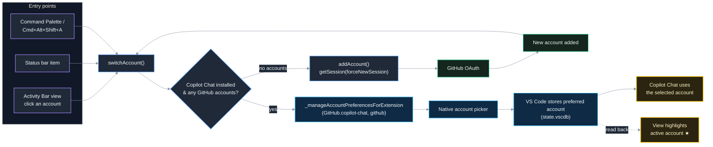
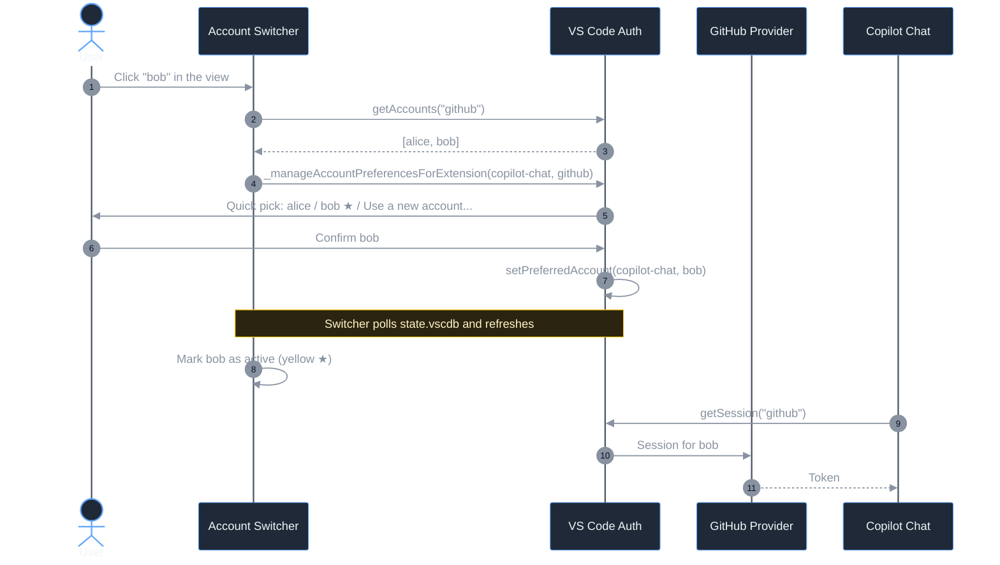

# Copilot Account Switcher

Quickly switch which GitHub account GitHub Copilot uses in VS Code, without signing out of your other accounts.

## How it works

VS Code lets you be signed in to several GitHub accounts at once and keeps a per-extension "preferred account". This extension exposes that mechanism for Copilot:





- **Copilot Accounts** view in the Activity Bar — lists signed-in GitHub accounts with their GitHub avatars; the account Copilot currently uses is highlighted in yellow with a ★. Click another account to switch to it (the native picker opens — confirm with Enter). Title-bar actions let you switch, add, or refresh.
- **Copilot Account: Switch Account** (`Cmd+Alt+Shift+A` / `Ctrl+Alt+Shift+A`) — opens the native account picker for the Copilot Chat extension. Pick an account, or choose *Use a new account...* to sign in to another one.
- **Copilot Account: Add GitHub Account** — signs in to an additional GitHub account, then offers to switch Copilot to it.
- **Copilot Account: List GitHub Accounts** — shows every signed-in GitHub account.
- A status bar item (`$(github) Copilot: N accounts`) opens the switcher on click.

After switching, Copilot Chat picks up the new account; if it does not, run **Developer: Reload Window**.

## Settings

| Setting | Default | Description |
| --- | --- | --- |
| `copilotAccountSwitcher.targetExtension` | `GitHub.copilot-chat` | Which Copilot extension's account preference to change (`GitHub.copilot-chat` or `GitHub.copilot`). |
| `copilotAccountSwitcher.showStatusBar` | `true` | Show the status bar item. |

## Requirements

- VS Code 1.96 or newer (multi-account support and `_manageAccountPreferencesForExtension`).
- GitHub Copilot Chat installed.
- `sqlite3` on your `PATH` (preinstalled on macOS and most Linux distros) — used read-only to detect which account Copilot currently prefers. Without it the view still works, but no account is highlighted.

## Development

```sh
npm install
npm run compile   # type-check, lint, bundle
npm test          # run extension tests
```

Press `F5` to launch an Extension Development Host.
