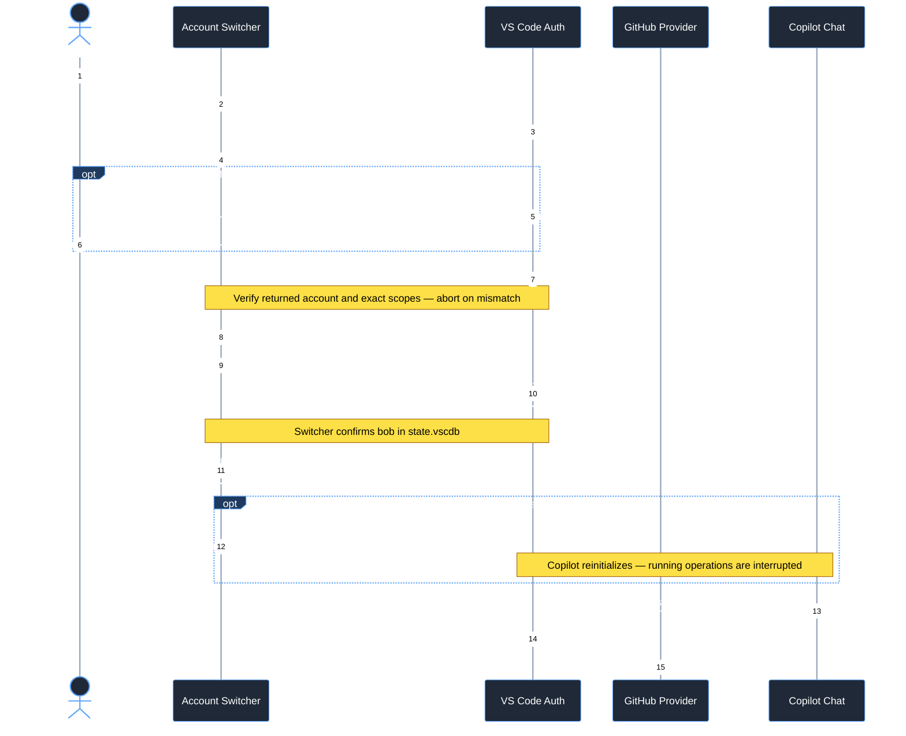

# Account Switcher

Switch, with one click, which **GitHub account GitHub Copilot uses** in VS Code — without signing out of your other accounts.

## How it works

VS Code lets you be signed in to several GitHub accounts at once and keeps a per-extension "preferred account". This extension exposes that mechanism for Copilot:

```mermaid
%%{init: {
  "theme": "base",
  "themeVariables": {
    "fontFamily": "ui-sans-serif, system-ui, sans-serif",
    "primaryColor": "#1f2937",
    "primaryTextColor": "#f1f5f9",
    "primaryBorderColor": "#60a5fa",
    "secondaryColor": "#312e81",
    "tertiaryColor": "#111827",
    "lineColor": "#8892a0",
    "textColor": "#f1f5f9",
    "clusterBkg": "#111827",
    "clusterBorder": "#4b5563",
    "edgeLabelBackground": "#1f2937"
  }
}}%%
flowchart LR
    classDef entry fill:#1f2937,stroke:#a78bfa,color:#f1f5f9,stroke-width:1.5px
    classDef logic fill:#1f2937,stroke:#60a5fa,color:#f1f5f9,stroke-width:1.5px
    classDef vscode fill:#0f2a44,stroke:#38bdf8,color:#f1f5f9,stroke-width:1.5px
    classDef github fill:#14261e,stroke:#34d399,color:#f1f5f9,stroke-width:1.5px
    classDef result fill:#2b2410,stroke:#facc15,color:#fef3c7,stroke-width:2px

    subgraph Entry["Entry points"]
        A["Activity Bar view<br/>click an account"]
        C["Command Palette /<br/>Cmd+Alt+Shift+A"]
    end

    A & C --> S["selectAccount()"]
    S --> Chk{"Copilot Chat installed<br/>&amp; any GitHub accounts?"}
    Chk -- "no accounts" --> Add["addAccount()<br/>getSession(forceNewSession)"]
    Add --> GH["GitHub OAuth"] --> Acc["New account added"] --> S
    Chk -- "yes" --> Session["Authorize selected account<br/>with Copilot's exact permission set"]
    Session --> Cmd["runCommands: open native picker,<br/>move to account, accept<br/>(motion disabled → nothing painted)"]
    Cmd --> Pref["VS Code stores preferred account<br/>(state.vscdb)"]
    Pref --> Confirm["Confirm selected preference<br/>by reading state.vscdb"]
    Confirm --> Reload["Reload window<br/>(enabled by default)"]
    Reload --> Copilot["Copilot Chat reinitializes<br/>with the selected preference"]
    Pref -. "read back" .-> View["View highlights<br/>preferred account ★"]

    class A,C entry
    class S,Chk,Add,Session,Confirm logic
    class Cmd,Pref,Reload vscode
    class GH,Acc github
    class Copilot,View result
```





- **GitHub Copilot** section in the Activity Bar view — lists signed-in GitHub accounts with their GitHub avatars; the preferred account is highlighted in yellow with a ★. Click an account to select it; a progress bar and spinner show while the preference is saved and verified, then the window reloads by default. Title-bar actions let you switch, add, or refresh.
- **Account Switcher: Switch Copilot Account** (`Cmd+Alt+Shift+A` / `Ctrl+Alt+Shift+A`) — the same list as a quick pick, plus *Use a new account...*.
- **Account Switcher: Add GitHub Account** — signs in to an additional GitHub account with Copilot-compatible permissions, then offers to switch Copilot to it.

Before switching, Account Switcher obtains a session for the **selected account with Copilot's exact permission set**. In default mode this is `read:user`, `user:email`, `repo`, and `workflow`. If Copilot's `github.copilot.advanced.authPermissions` is `minimal` (including the object-style `github.copilot.advanced` setting), only `user:email` is requested. The extension does not change Copilot's permission settings.

VS Code/GitHub may ask you to authorize access or sign in to the selected account. Repository and workflow permissions are broader than basic identity permissions; approve them only if acceptable for that account. A matching session is reused when available. Tokens are never logged, written to files, or stored by Account Switcher.

**Why the saved preference alone is not enough:** GitHub sessions are matched by exact scope sets. Copilot tries its permissive scope set first in default mode. If the preferred account has only the old switcher's `read:user` + `user:email` session, VS Code can return another account's matching session instead. Reloading alone does not repair that mismatch. Selecting the account again with this version prepares the required session first.

After the session is prepared and the selected preference is confirmed, the extension **automatically reloads the current VS Code window** so Copilot reinitializes. This interrupts running chat/tool operations; finish them before switching. The selected account must have valid Copilot access. Clicking the already-preferred account also prepares its session before reloading, repairing accounts added by older versions.

Set `accountSwitcher.reloadOnSwitch` to `false` to keep the window open and rely on Copilot's account-change handling instead. In that mode, immediate activation is not guaranteed; run **Developer: Reload Window** if Copilot still uses the previous account. The star indicates the saved preference, not a verified live Copilot session.

If authorization is canceled, fails, or returns a different account or scope set, the extension does not change Copilot's preference or reload. If the selected preference cannot be verified or a different account is detected after selection, the extension warns instead of reloading. Session preparation and preference checks are not independent verification of Copilot's live account; its **GitHub Copilot Chat** output log records the account used to acquire a Copilot token.

> **Claude Code** is not handled by this extension. It authenticates with Anthropic rather than GitHub and manages its own login — use *Sign out* / *Sign in* in the Claude Code panel to change accounts.

## Settings

| Setting | Default | Description |
| --- | --- | --- |
| `accountSwitcher.copilotExtension` | `GitHub.copilot-chat` | Which Copilot extension's account preference to change (`GitHub.copilot-chat` or `GitHub.copilot`). |
| `accountSwitcher.reloadOnSwitch` | `true` | Reload the current window after confirming the selected account, including reselecting the preferred account. Interrupts running chat/tool operations. Disable for best-effort switching without reload. |

## Requirements

- VS Code 1.96 or newer (multi-account support and `_manageAccountPreferencesForExtension`).
- GitHub Copilot Chat installed.
- GitHub.com authentication (including managed accounts on github.com). A separately configured `github-enterprise` provider is not supported; switching is blocked rather than changing an unrelated github.com preference.
- `sqlite3` on your `PATH` (preinstalled on macOS and most Linux distros) — used read-only to detect and verify Copilot's preferred account. Without it the view still works, but no account is highlighted and automatic reload is skipped because the selection cannot be confirmed.

## Build and install

The extension is not on the Marketplace; build the VSIX yourself and install it.

1. Prerequisites: [Node.js](https://nodejs.org/) 20 or newer and the `code` CLI on your `PATH` (in VS Code: **Shell Command: Install 'code' command in PATH**).
2. Get the source and build:

   ```sh
   git clone https://github.com/OleksiiTimofieiev/vscode-account-switcher.git
   cd vscode-account-switcher
   npm install
   npm run compile
   ```

3. Package it as a VSIX:

   ```sh
   npx @vscode/vsce package
   ```

   This produces `vscode-account-switcher-<version>.vsix` in the project folder.

4. Install into VS Code (either way):

   ```sh
   code --install-extension vscode-account-switcher-0.0.1.vsix --force
   ```

   or, in VS Code: **Extensions** view → `···` menu → **Install from VSIX...** and pick the file.

5. Run **Developer: Reload Window**. The **Account Switcher** icon appears in the Activity Bar.

To update after changing the source, repeat steps 3–5 — an installed VSIX is not refreshed by `npm run compile`. To uninstall: `code --uninstall-extension otimofie.vscode-account-switcher`.

## Sharing with your team

The `.vsix` produced by `npx @vscode/vsce package` is self-contained: teammates do not need Node.js or the source, only the file.

### Send the file

Share `vscode-account-switcher-<version>.vsix` (chat, shared drive, …). Recipients install it with:

```sh
code --install-extension vscode-account-switcher-0.0.1.vsix
```

or **Extensions** view → `···` → **Install from VSIX...**, then **Developer: Reload Window**. There are no auto-updates — send a new file for each release.

### GitHub Release (recommended)

Publish the VSIX as a release asset so there is one stable download link. The commands below create the next patch release, `v0.0.2`, from the current `0.0.1` version:

```sh
git status                                          # confirm the working tree is clean
npm test                                            # validate the release
npm version patch                                   # bumps package.json, commits, tags v0.0.2
make package                                        # creates vscode-account-switcher-0.0.2.vsix
git push --follow-tags
gh release create v0.0.2 vscode-account-switcher-0.0.2.vsix \
  --title "v0.0.2" \
  --generate-notes
```

The `gh` command requires GitHub CLI authentication (`gh auth login`). Replace `npm version patch` and the versioned names with `npm version minor` or `npm version major` when the change requires a larger version increment.

Teammates download the `.vsix` from the repository's **Releases** page and install it as above. If the repository is private they need read access.

### Marketplace

For public distribution with automatic updates, publish to the VS Code Marketplace:

1. Create a publisher at <https://marketplace.visualstudio.com/manage> with the ID `otimofie` (must match `publisher` in `package.json`).
2. Create an Azure DevOps Personal Access Token at <https://dev.azure.com> (**User settings → Personal access tokens**): Organization *All accessible organizations*, scope **Marketplace → Manage**.
3. Publish:

   ```sh
   npx @vscode/vsce login otimofie      # paste the PAT
   npx @vscode/vsce publish             # or: publish patch|minor|major to bump the version first
   ```

The extension is then listed at `https://marketplace.visualstudio.com/items?itemName=otimofie.vscode-account-switcher`. Note that the Marketplace is public; there is no private, team-scoped gallery for VS Code. For Cursor / VSCodium users, publish to [Open VSX](https://open-vsx.org) as well: `npx ovsx publish vscode-account-switcher-<version>.vsix -p <token>`.

## Development

```sh
npm install
npm run watch     # rebuild on change (tsc + esbuild)
npm run compile   # type-check, lint, bundle
npm test          # run extension tests
```

Press `F5` to launch an Extension Development Host with the current source; no packaging or install is needed for that.
