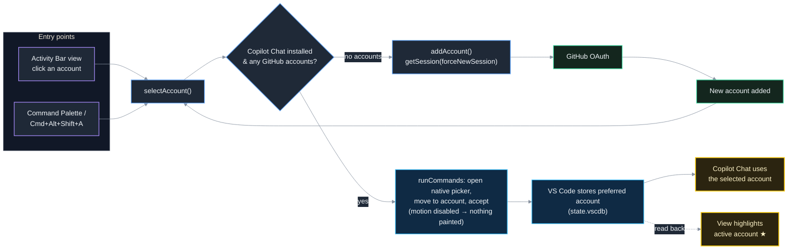
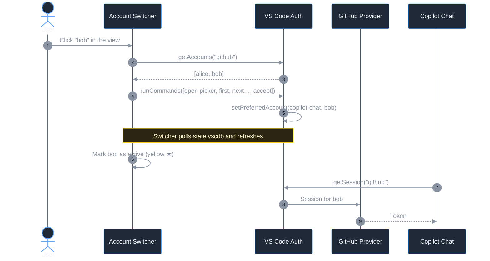

# Account Switcher

Switch, with one click, which **GitHub account GitHub Copilot uses** in VS Code — without signing out of your other accounts.

## How it works

VS Code lets you be signed in to several GitHub accounts at once and keeps a per-extension "preferred account". This extension exposes that mechanism for Copilot:





- **GitHub Copilot** section in the Activity Bar view — lists signed-in GitHub accounts with their GitHub avatars; the account Copilot currently uses is highlighted in yellow with a ★. Click another account to switch to it silently (a progress bar and spinner show while it completes). Title-bar actions let you switch, add, or refresh.
- **Account Switcher: Switch Copilot Account** (`Cmd+Alt+Shift+A` / `Ctrl+Alt+Shift+A`) — the same list as a quick pick, plus *Use a new account...*.
- **Account Switcher: Add GitHub Account** — signs in to an additional GitHub account, then offers to switch Copilot to it.

After switching, Copilot Chat picks up the new account; if it does not, run **Developer: Reload Window**.

> **Claude Code** is not handled by this extension. It authenticates with Anthropic rather than GitHub and manages its own login — use *Sign out* / *Sign in* in the Claude Code panel to change accounts.

## Settings

| Setting | Default | Description |
| --- | --- | --- |
| `accountSwitcher.copilotExtension` | `GitHub.copilot-chat` | Which Copilot extension's account preference to change (`GitHub.copilot-chat` or `GitHub.copilot`). |

## Requirements

- VS Code 1.96 or newer (multi-account support and `_manageAccountPreferencesForExtension`).
- GitHub Copilot Chat installed.
- `sqlite3` on your `PATH` (preinstalled on macOS and most Linux distros) — used read-only to detect which account Copilot currently prefers. Without it the view still works, but no account is highlighted.

## Build and install

The extension is not on the Marketplace; build the VSIX yourself and install it.

1. Prerequisites: [Node.js](https://nodejs.org/) 20 or newer and the `code` CLI on your `PATH` (in VS Code: **Shell Command: Install 'code' command in PATH**).
2. Get the source and build:

   ```sh
   git clone https://github.com/OleksiiTimofieiev/plugin.git
   cd plugin
   npm install
   npm run compile
   ```

3. Package it as a VSIX:

   ```sh
   npx @vscode/vsce package
   ```

   This produces `vscode-account-switcher-<version>.vsix` in the project folder.

4. Install into VS Code (either way):

   ```sh
   code --install-extension vscode-account-switcher-0.0.1.vsix --force
   ```

   or, in VS Code: **Extensions** view → `···` menu → **Install from VSIX...** and pick the file.

5. Run **Developer: Reload Window**. The **Account Switcher** icon appears in the Activity Bar.

To update after changing the source, repeat steps 3–5 — an installed VSIX is not refreshed by `npm run compile`. To uninstall: `code --uninstall-extension otimofie.vscode-account-switcher`.

## Sharing with your team

The `.vsix` produced by `npx @vscode/vsce package` is self-contained: teammates do not need Node.js or the source, only the file.

### Send the file

Share `vscode-account-switcher-<version>.vsix` (chat, shared drive, …). Recipients install it with:

```sh
code --install-extension vscode-account-switcher-0.0.1.vsix
```

or **Extensions** view → `···` → **Install from VSIX...**, then **Developer: Reload Window**. There are no auto-updates — send a new file for each release.

### GitHub Release (recommended)

Publish the VSIX as a release asset so there is one stable download link:

```sh
npm version patch                                   # bumps package.json, commits, tags vX.Y.Z
npx @vscode/vsce package
git push --follow-tags
gh release create v0.0.2 vscode-account-switcher-0.0.2.vsix --title "v0.0.2" --notes "What changed"
```

Teammates download the `.vsix` from the repository's **Releases** page and install it as above. If the repository is private they need read access.

### Marketplace

For public distribution with automatic updates, publish to the VS Code Marketplace:

1. Create a publisher at <https://marketplace.visualstudio.com/manage> with the ID `otimofie` (must match `publisher` in `package.json`).
2. Create an Azure DevOps Personal Access Token at <https://dev.azure.com> (**User settings → Personal access tokens**): Organization *All accessible organizations*, scope **Marketplace → Manage**.
3. Publish:

   ```sh
   npx @vscode/vsce login otimofie      # paste the PAT
   npx @vscode/vsce publish             # or: publish patch|minor|major to bump the version first
   ```

The extension is then listed at `https://marketplace.visualstudio.com/items?itemName=otimofie.vscode-account-switcher`. Note that the Marketplace is public; there is no private, team-scoped gallery for VS Code. For Cursor / VSCodium users, publish to [Open VSX](https://open-vsx.org) as well: `npx ovsx publish vscode-account-switcher-<version>.vsix -p <token>`.

## Development

```sh
npm install
npm run watch     # rebuild on change (tsc + esbuild)
npm run compile   # type-check, lint, bundle
npm test          # run extension tests
```

Press `F5` to launch an Extension Development Host with the current source; no packaging or install is needed for that.
